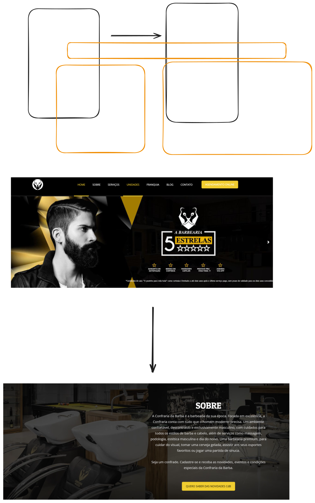

# sistema-petshop

Sistema de exemplo para minhas aulas de [Programador WEB](https://jocile.com/programador-web/)

Questionário inicial de análise para criação do [Briefing](Briefing.md)

Sistema desenvolvido no curso Programação WEB no Senac  

## Conhecendo o negócio de um PetShop  

1. Conte-me sobre o negócio da sua empresa, seu objetivo e o mercado onde atua:  
   > A atuação da minha empresa é no ramo pet shop, onde oferecemos uma variedade de produtos para animais de estimação (pets) e serviços como consultas veterinárias.

2. Que tipo de produtos/serviços sua empresa oferece?  
   > Comercialização de alimentos específicos para pets, itens de higiene e conforto, além de serviços de grooming e banho.

3. O que diferencia você de seus concorrentes (preço, qualidade, variedade etc.)?  
   > A qualidade dos produtos e a atuação direta no mercado pet, com uma equipe especializada em cuidados animais.

4. Descreva abaixo o público alvo do seu negócio:  
   - Pet lovers, especialmente donos de cães, gatos e outros pequenos animais de estimação.

5. Descreva abaixo os conteúdos que deverão ser inseridos no site (história da empresa, descrição e fotos de produtos, serviços etc):  
   > Produtos disponíveis na loja (alimentos, itens para brinquedo), serviços oferecidos pelo veterinário, história da empresa, localização do PetShop, contatos, e fotos dos produtos e ambiente.

6. Qual a Imagem a ser transmitida para os usuários? (tradição ou modernidade, variedade de produtos, etc.)  
   > Tradição no atendimento animal com um layout clean e moderno, cores que refletem cuidado e responsabilidade.

7. Qual a Documentação disponível? (logotipo, folders, catálogo etc)  
   > Não temos documentação específica atualmente; gostaríamos de criar uma identidade visual nova para o PetShop.

8. Descreva as ferramentas de marketing utilizadas atualmente:  
   > Atualmente usamos folders e anúncios em redes sociais, como Instagram e Facebook, para promover os produtos e serviços do PetShop.

9. Se possível, informe o nome e o website de seus principais concorrentes:  
   > Petz <https://www.petztudo.com.br/>  
   > Raia Pet <https://raiapet.com.br/>

10. Qual o principal objetivo do seu website?  
    > Promover os produtos para pets, disponibilizar informações sobre serviços veterinários e facilitar a compra online.

11. Você pretende que o site esteja pronto em torno de: (dias)  
    > 180 dias.

12. Cite 3 coisas que você, se pudesse, mudaria/adicionaria hoje mesmo no website:  
    - Catálogo interativo de produtos com descrições detalhadas e fotos de alta qualidade.  
    - Espaço para avaliações dos clientes sobre a qualidade dos serviços.  
    - Sistema de agendamento online para consultas veterinárias.

13. Liste até 2 websites que você considere interessantes, informando o que especificamente lhe agrada neles:  
   > <https://www.petlove.com.br/> A variedade de produtos e a interface amigável.  
   > <https://www.petiscoservicos.com.br/> O layout limpo e as informações sobre serviços bem organizadas.

14. Liste até 3 websites que você considere desagradáveis, informando o que especificamente lhe desagrada neles:  
   > <https://www.clinicaveterinaria.com.br> A interface pode ser muito complexa para alguns usuários.  
   > <http://petshopnomeempresa.com.br> O design visual pode não transmitir confiança nem modernidade necessária.

